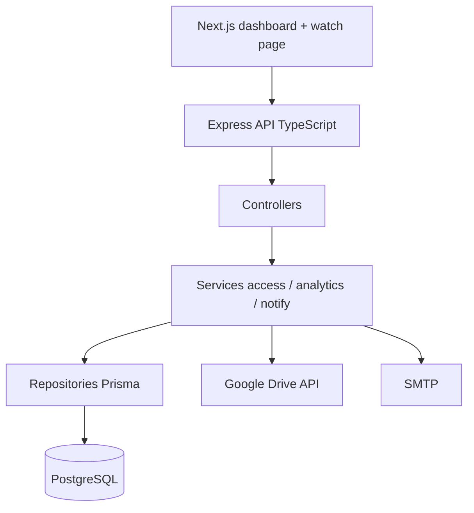

# Content Delivery System (CDS)

Platform for sharing videos and other files through secure, client-specific links. Files stay in Google Drive. CDS handles delivery rules, access control, analytics, notifications, and audit trails.

Live frontend: https://content-delivery-system-frontend.vercel.app

Supports videos, PDFs, DOCX, PPTX, images, audio, and ZIP as first-class content types.

## Highlights

- Cryptographically random delivery tokens (store SHA-256 hashes only)
- Access rules: expiry, max views/sessions/devices/concurrent users, password, IP/domain allowlists
- Embeddable watch player + optional domain lock
- RBAC: SUPER_ADMIN, CONTENT_MANAGER, READ_ONLY
- Google OAuth + Drive browse/sync
- Analytics, SMTP alerts, audit log, CSV/XLSX/PDF reports
- Docker Compose stack with Postgres + Prisma

## Architecture



Composition root: `backend/src/container.ts` (dependency injection).

```
backend/     Express API, Prisma, seed
frontend/    Next.js App Router dashboard + public watch
docs/API.md  API reference
docker-compose.yml
```

## Quick start (Docker)

```bash
cp .env.example .env
# Set JWT/LINK secrets, Google credentials, SMTP, BOOTSTRAP_SUPER_ADMIN_EMAIL
docker compose up --build
docker compose exec backend npx prisma db seed
```

- Frontend: http://localhost:3000
- API: http://localhost:4000

## Local development

Needs Node 20+ and PostgreSQL.

```bash
npm install
cd backend && npx prisma migrate deploy && npm run seed && npm run dev
cd frontend && NEXT_PUBLIC_API_URL=http://localhost:4000 npm run dev
```

Dev email login appears when Google OAuth is not configured (disabled in production).

## Docs

See [docs/API.md](docs/API.md) for endpoints and auth details.
